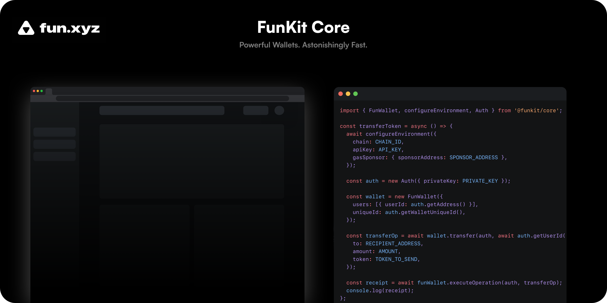

# **FunKit Core**

FunKit empowers you to create feature-rich and extensible smart wallets built on account abstraction. Leveraging the FunKit, you can customize gas behavior, adopt multi-sig and common authentication method, monetize your application, execute any transactions from smart wallets, and much more.

This repo only covers FunKit Core SDK which does not provide any frontend specific optimizations. Check our [Web SDK](https://github.com/fun-xyz/funkit-react) if you want to further simplify your application with our react hooks.

## **Table of Contents**

1. **[Installation](#installation)**
2. **[Quick Start](#quickstart)**
3. **[Testing](#testing)**
4. **[More Resources](#moreresources)**

## <a id="installation"></a> **Installation**

```
npm i @funkit/core --save
# or
yarn add @funkit/core
```

## <a id="quickstart"></a> **Quick Start**

FunKit needs to be configured with an API key. Get a key by logging to our [dashboard](https://app.fun.xyz/sign-in/request).

### 1. Import

Import all required classes.

```js
import { FunWallet, configureEnvironment, Auth } from "@funkit/core"
```

### 2. Configure wallet environment

Set your environment variables describing how your smart wallets interact with blockchains. This can include chain, apiKey, and optional gasSponsor.

1. `chain` - Each FunWallet exists on an [EVM-compatible blockchain](https://ethereum.org/en/developers/docs/evm/).
2. `apiKey` - You can get an API key by logging to our [dashboard](https://app.fun.xyz/sign-in/request).
3. `gasSponsor` - All wallets have to pay gas to execute transactions on a blockchain. You can pre-fund the wallet with native tokens or you can have third parties to pay for gas by specifying a [gasSponsor](https://docs.fun.xyz/api-reference/gas-sponsor).

```js
await configureEnvironment({
    chain: CHAIN_ID,
    apiKey: API_KEY,
    gasSponsor: {
        sponsorAddress: SPONSOR_ADDRESS
    }
})
```

### 3. Set up authentication

Next, you need a way to sign transactions. All authentication in FunKit is handled with the Auth object. You can use privateKey, viem client, web3 provider, ethers.js signer, rpcProvider or windowEth (MetaMask) to build the Auth. Check more examples about how to create auth with different inputs [here](https://docs.fun.xyz/api-reference/auth)

```js
const auth = new Auth({ privateKey: PRIVATE_KEY })
```

### 4. Initialize the FunWallet

With the Auth instance that you just created, you can now initialize your FunWallet. Here are the FunWallet constructor parameters:

1. `users` - This is a `User[]` that holds all `users` that can access your `FunWallet`. For simplicity, we’re only including 1 user here.
2. `uniqueId` - This is a random seed that is generated from our `Auth` instance. The purpose of this seed is to generate the `address` of our `FunWallet`.

```js
const wallet = new FunWallet({
    users: [{ userId: auth.getAddress() }],
    uniqueId: auth.getWalletUniqueId()
})
```

### 5. Initiate a Transfer

Now we have the wallet object, we will show how to transfer some basic ERC-20 tokens to other addresses. Note that the smart wallet will only be created on the blockchain after executeOperation is finished.

```js
const transferOp = await wallet.transfer(auth, await auth.getUserId(), {
    to: RECIPIENT_ADDRESS,
    amount: AMOUNT,
    token: TOKEN_TO_SEND
})
const receipt = await funWallet.executeOperation(auth, transferOp)
console.log(receipt)
```

## <a id="testing"></a> **Testing**

### **Testing on Goerli**

You can test FunKit on Ethereum goerli testnet with the following configuration. We have a gas sponsor that will cover your gas cost for the first 200 operations so you don’t have to worry about pre-funding the wallet or setting up the gas sponsor to start.

```js
await configureEnvironment({
    chain: "goerli",
    gasSponsor: {
        sponsorAddress: "0xCB5D0b4569A39C217c243a436AC3feEe5dFeb9Ad"
    },
    apiKey: API_KEY
})
```

## <a id="moreresources"></a> **More Resources**

-   [Documentation](http://docs.fun.xyz) - Complete how-to guides and API reference docs.
-   [Demo](https://demo.fun.xyz) - Try FunKit Core in action.
-   [Discord](https://discord.com/invite/KhJVrDy3) - Ask us a question, or just say hi!
